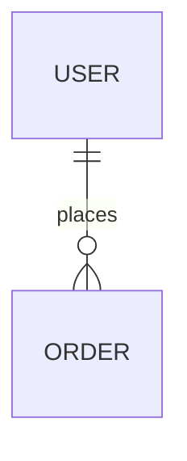

# Luotopia 文档站（Docusaurus）

三个**一级路由**、三套侧边栏：

| 路由 | 内容 | 源目录 |
|------|------|--------|
| **`/user`** | 用户操作指南 | `user-docs/` |
| **`/client`** | 客户端开发 | `client-docs/` |
| **`/server`** | 服务端开发 | `server-docs/` |

首页 `/` 为站点 landing（`src/pages/index.tsx`）。

## 本地预览

```bash
cd docs
npm install   # 首次
npm start
```

- http://localhost:3000/user/
- http://localhost:3000/client/
- http://localhost:3000/server/

## 构建

```bash
npm run build
npm run serve
```

## 配置要点

- `docusaurus.config.ts`：三个 `@docusaurus/plugin-content-docs` 实例（`docs: false` 关闭默认插件）
- 侧边栏：`sidebarsUser.ts` / `sidebarsClient.ts` / `sidebarsServer.ts`
- **跨分区链接**须用 `pathname:///user/` 等形式（相对 `.md` 链不能跨 plugin）

## 维护

| 改什么 | 改哪里 |
|--------|--------|
| 用户怎么用 App | `user-docs/` |
| Flutter 开发 | `client-docs/` |
| Go / 部署 | `server-docs/`（`architecture` / `development` / `api` / `deployment` / `modules` / `advanced` / `meta`） |

侧栏顺序靠各页 `sidebar_position` + 目录 `_category_.json` 的 `position`（三套均为 autogenerated）。

### 推荐侧栏顺序

**用户** `1→11`：概览 → 开始 → 账号 → 课表 → 成绩 → 校园 → 日程 → AI → 设置 → 隐私 → FAQ  

**客户端** `0→16`：概览 → 环境 → 架构 → 目录 → Feature 约定 → 状态 → UI → 多端 → 认证 → API → 校园 → 教务认证 → 子应用 → WebView → 功能地图 → 更新 → 测试  

**服务端顶层**：概览(0) → 架构(1) → 开发(2) → API(3) → 部署(4) → 模块(5) → CLI(6) → 高级(7) → 规范(8)

废弃协议、目录迁移与未落地能力不在各页面重复铺陈：

- 客户端：[已移除与迁移](./client-docs/removed-and-migrated.md)
- 服务端：[已移除与迁移](./server-docs/meta/removed-and-migrated.md)

### 近期易漂移点（改代码时记得同步文档）

| 主题 | 用户 | 客户端 | 服务端 |
|------|------|--------|--------|
| 安装包检查 / prerelease | `user-docs/settings.md`、`faq.md` | `client-docs/updates.md`、`features.md` | `modules/system.md`（边界说明） |
| 热更新解析脚本 | 同上 | `updates.md` | 无（homepage 静态） |
| 校巴卡片 vs 网格 | `user-docs/campus.md` | `client-docs/campus.md` | `campus_proxies.md` |
| 导航 Tab 默认/隐藏 | `getting-started.md`、`settings.md` | `NavigationSettings` 代码 | — |
| SnackBar 在弹窗上 | — | `client-docs/components.md` | — |
| 业务服 vs 官网 URL | `settings.md` | `auth.md`、`api_integration.md` | `campus_proxies` / `system` |
| 校园子应用清单 | `user-docs/campus.md` | `campus-sub-apps.md`、`features.md` | — |
| 热更新影响导入 | `timetable.md`、`scores.md` | `updates.md` | — |
| 官网 / Releases | `privacy-and-data.md` | `updates.md` | `modules/external_surfaces.md` |
| Feature 迁址 | — | `feature-architecture.md` | — |

### 开源文档 vs 闭源代码

文档站开源；App / Server / 业务实现默认闭源。写作时：

- **要**：协议与边界、模块职责、联调步骤、OpenAPI 摘要、工程约定  
- **不要**：密钥、可复现的第三方逆向、未公开 API、大段闭源实现  

完整规则：[server-docs/meta/public_docs_policy.md](./server-docs/meta/public_docs_policy.md)（站点内 `/server/meta/public-docs-policy` 以 slug 为准）。

已按该策略收敛（持续）：论坛热度/审核阈值、搜索与集成测试长文、课表结构体、审核词库、WebView 业务脚本、CI 镜像占位、性能调优原则级。

### Mermaid 图

已启用 `@docusaurus/theme-mermaid` + `markdown.mermaid: true`。  
在 Markdown 中使用：

````md

````

注意：ER 实体属性块内**不要**写 `%%` 注释（会破坏解析）。复杂注释写在图外。

用户指南：`/user/`（源目录 `user-docs/`）。
