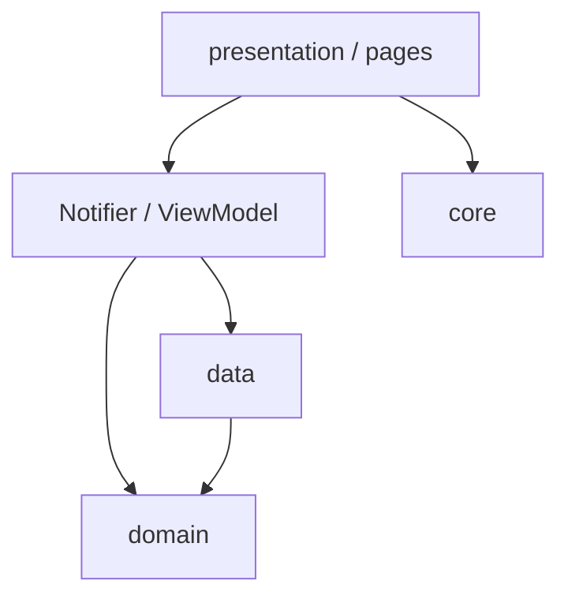

# 架构总览

客户端采用 **feature-first + 轻量 MVVM**，状态用 **Riverpod**。

## 分层

| 层 | 职责 |
|----|------|
| `presentation` | 页面、组件、ViewModel/Notifier；只编排 UI 状态 |
| `domain` | 实体、规则、仓储接口；不依赖 Flutter UI |
| `data` | DTO、Mapper、仓储实现；本地 / 网络 |

装配在 `app/`：启动、路由、全局 Shell。

## 目录

见 [目录结构](./project-structure.md)。逻辑示意：

## 状态管理

- 页面级状态：`Notifier` / `AsyncNotifier`，优先 `autoDispose`  
- 依赖注入：`Provider` / `NotifierProvider`  
- 读一次用 `ref.read`；构建期订阅用 `ref.watch`  

详见 [状态管理](./state_management.md)。

## 网络

- Dio：`core/api/api_providers.dart`  
- OpenAPI 生成：`core/api_client`  
- 认证：Bearer + 401 刷新  
- 官网静态 / Pages Function：`http` + `AppConfig.siteBaseUrl`  

详见 [API 对接](./api_integration.md) · [认证](./auth.md) · [更新与热更新](./updates.md)。

## UI

- **Material 3**（含 M3E 组件）  
- 通用组件：`shared` 或 feature 内 widgets  
- 全局 SnackBar：`showAppSnackBar*` / `rootScaffoldMessengerKey`  

详见 [UI 与组件](./components.md)、[Feature 约定](./feature-architecture.md)。

## 相关

- [功能模块](./features.md)
- [校园功能](./campus.md)
- 仓库 `app/lib/README.md`
