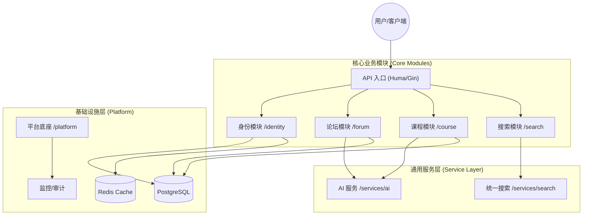

# 系统架构概览

Luotopia Server 采用 **模块化单体 (Modular Monolith)** 架构，旨在平衡开发效率与系统的可维护性。

## 1. 核心设计原则
- **领域驱动 (DDD)**: 业务逻辑按领域划分为独立的模块（如 `identity`, `forum`, `course`）。
- **显式依赖**: 模块间通过定义的 Service 接口或基础库进行通信，严禁循环依赖。
- **底座统一**: 所有的基础设施（数据库、缓存、监控）由 `internal/platform` 统一管理。

## 2. 系统组件图

## 3. 关键模块职责
- **Identity**: 基于 OIDC 协议的身份中心，负责登录、权限及租户管理。
- **Forum**: 社区互动核心，包含发帖、评论及基于 AI 的内容风控。
- **Course**: 教学数据中心，支持课程检索、评价及教务数据同步。
- **Platform**: 提供数据库初始化、全局中间件、缓存驱动及监控指标。

## 4. 数据流向示例 (以登录为例)
1. 客户端请求 `/api/v1/login`。
2. `Identity` 模块验证凭据并生成 JWT。
3. `Identity` 调用 `Platform` 审计组件记录登录日志。
4. 返回 Token 给客户端。

## 5. 架构实现：模块化单体 (Modular Monolith)
 
Luotopia 采用严格的目录约束实现了“准微服务”的隔离性，同时保留了单体应用的开发便利。
 
### 5.1 模块隔离规范
- **`internal/platform` (全局底座)**: 
    - 这里的代码被所有模块共享，实现了单例模式的数据库连接池 (`database.GetDB()`) 和统一的配置加载。
    - **约束**: 模块间严禁直接引用对方的 `repo`，必须通过 `platform` 提供的基础设施或跨模块 Service 接口进行交互。
- **`internal/services` (能力适配层)**: 
    - 充当模块间的“缓冲区”。例如，搜索功能被封装为 `UnifiedSearchService`，论坛模块仅需调用该接口，而无需感知底层搜索引擎的具体实现。
- **模块自治 (`internal/[module]`)**: 
    - 每个模块拥有独立的 `model` (领域模型) 和 `repo` (持久层)。跨模块的数据交互建议通过事件总线或显式的 Service 接口。

### 5.2 请求生命周期与 Huma 框架
系统利用 **Huma v2** 框架实现类型安全与自动文档化：
 
1. **路由注册**: 在模块的 `RegisterRoutes` 中定义 `huma.Operation`，系统自动生成符合 OpenAPI 3.0 规范的文档。
2. **输入校验**: 根据 `Input` 结构体定义的标签（如 `minLength`）进行自动化 JSON 字段校验。
3. **拦截器链路**: 请求依次经过日志记录、JWT 身份校验及 API 签名校验中间件。
4. **业务路由**: Handler 接收校验后的强类型数据并执行业务逻辑。

## 6. 架构常见问题 (FAQ)

**Q: 为什么不直接使用微服务架构？**
A: 考虑到项目初期的开发效率与部署成本，模块化单体能在保持代码整洁的同时，降低分布式系统的运维复杂度。如果未来某个模块负载过高，可以低成本地将其拆分为独立微服务。

**Q: 模块间通信是否可以使用共享数据库表？**
A: **禁止**。每个模块应仅操作属于该领域的表。跨模块的数据查询应通过 Service 层或联表视图（由 Platform 统一管理）进行，以维持模块间的解耦。

---
[返回目录](../index.md)
