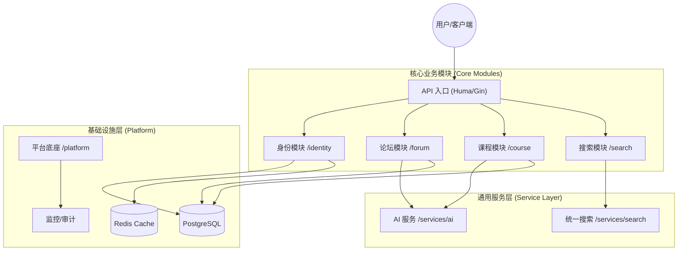

# 系统架构概览 (System Architecture Overview)

Luotopia Server 采用 **模块化单体 (Modular Monolith)** 架构，旨在平衡开发效率与系统的可维护性。

## 1. 核心设计原则
- **领域驱动 (DDD)**: 业务逻辑按领域划分为独立的模块（如 `identity`, `forum`, `course`）。
- **显式依赖**: 模块间通过定义的 Service 接口或基础库进行通信，严禁循环依赖。
- **底座统一**: 所有的基础设施（数据库、缓存、监控）由 `internal/platform` 统一管理。

## 2. 系统组件图 (Component Diagram)

## 3. 关键模块职责
- **Identity**: 基于 OIDC 协议的身份中心，负责登录、权限及租户管理。
- **Forum**: 社区互动核心，包含发帖、评论及基于 AI 的内容风控。
- **Course**: 教学数据中心，支持课程检索、评价及教务数据同步。
- **Platform**: 提供数据库初始化、全局中间件、缓存驱动及监控指标。

## 4. 数据流向示例 (以登录为例)
1. 客户端请求 `/api/v1/login`。
2. `Identity` 模块验证凭据并生成 JWT。
3. `Identity` 调用 `Platform` 审计组件记录登录日志。
4. 返回 Token 给客户端。
