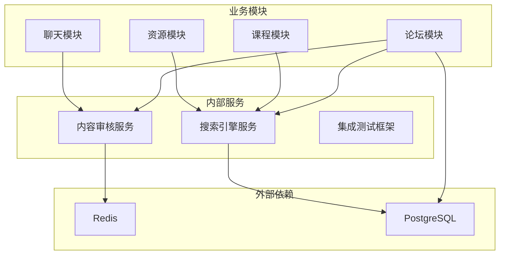

# 内部服务模块

本章节介绍 Luotopia 内部通用服务层的设计与实现。这些服务被多个业务模块复用，提供核心的基础设施功能。

## 服务列表

### [搜索引擎服务](./search_engine.md)
提供统一的搜索接口，基于 PostgreSQL 全文搜索实现。包含查询优化、缓存策略和故障恢复。

**核心功能**:
- 全文搜索
- 多字段搜索与过滤
- 同步策略（实时/批量）
- 故障恢复与重索引

**适用模块**: Forum（帖子搜索）、Course（课程搜索）、Materials（资源搜索）

### [内容审核服务](./content_moderation.md)
对用户生成的内容进行实时审核，检测敏感词、垃圾信息等违规内容。

**核心功能**:
- 敏感词过滤（多分类字典）
- 垃圾内容检测
- 审核日志记录
- 用户申诉处理

**适用模块**: Forum（帖子/评论）、Chat（聊天消息）

### [集成测试框架](./integration_testing.md) *（建设中）*
为各业务模块提供统一的集成测试工具，包括 Mock 数据库、缓存、外部服务等。

---

## 架构总图

---

[返回模块列表](./index.md)
