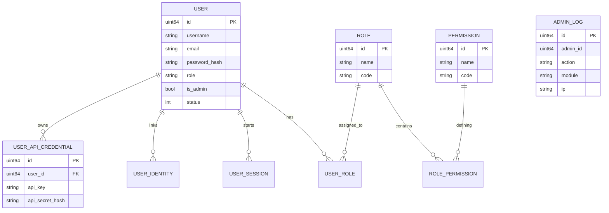

# 数据库设计与建模

Luotopia Server 使用 PostgreSQL 作为核心关系型数据库，通过 GORM 进行 ORM 映射。本系统采用统一的模型规范，确保数据一致性与可审计性。

## 1. 核心实体关系图

> 说明：`USER_API_CREDENTIAL` 为用户级集成凭证（请求头 `X-Api-Key` + `X-Api-Secret`），**不是**全站请求 HMAC。  
> 图中为概念示意；实际表/schema 以 GORM 模型与 `database.InitDB` 为准。

## 2. 通用基础模型
所有业务模型都应嵌入 `Base` 结构体，提供标准化的审计字段：

| 字段 | 类型 | 说明 |
| :--- | :--- | :--- |
| `id` | `uint64` | 主键，由数据库自增生成 |
| `created_at` | `time.Time` | 记录创建时间 |
| `updated_at` | `time.Time` | 记录最后一次更新时间 |
| `deleted_at` | `gorm.DeletedAt` | 软删除标记，用于数据恢复与审计 |

## 3. 关键设计模式

### 3.1 权限控制 (RBAC)
系统采用标准的 **基于角色的访问控制 (RBAC)** 模型：
- `UserRole`: 多对多关联，一个用户可以拥有多个角色（当前实现偏向单角色，但结构支持多角色）。
- `RolePermission`: 多对多关联，定义角色所拥有的具体操作权限。

### 3.2 审计日志
`AdminLog` 表记录了所有敏感的后台操作。系统会自动通过中间件或 Service 层拦截器记录操作者的 ID、动作、目标以及详细的变更前后内容。

### 3.3 身份联邦
`UserIdentity` 表允许一个系统用户关联多个第三方身份（如 SSO、GitHub、WeChat），实现了“一个账户，多种登录方式”的逻辑。

## 4. 性能优化建议
- **索引**: 核心字段（如 `username`, `email`, `session_id`, `api_key`）均建立了唯一索引。
- **外键**: 为了保证删除性能，系统层级尽量减少物理外键约束，而是在业务逻辑层保证完整性。
