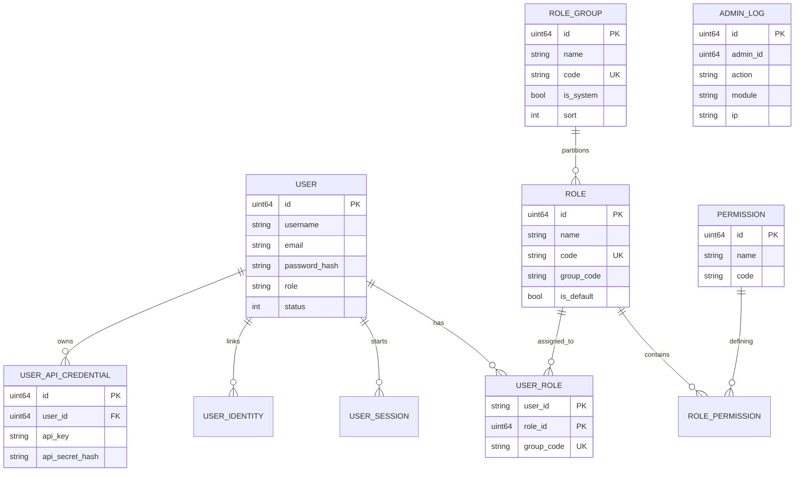

Luotopia Server 使用 PostgreSQL 作为核心关系型数据库，通过 GORM 进行 ORM 映射。本系统采用统一的模型规范，确保数据一致性与可审计性。

## 核心实体关系图

```mermaid
erDiagram
    USER ||--o{ USER_ROLE : has
    ROLE ||--o{ USER_ROLE : assigned_to
    ROLE_GROUP ||--o{ ROLE : partitions
    ROLE ||--o{ ROLE_PERMISSION : contains
    PERMISSION ||--o{ ROLE_PERMISSION : defining
    USER ||--o{ USER_SESSION : starts
    USER ||--o{ USER_IDENTITY : links
    USER ||--o{ USER_API_CREDENTIAL : owns

    USER {
        uint64 id PK
        string username
        string email
        string password_hash
        string role
        int status
    }

    ROLE_GROUP {
        uint64 id PK
        string name
        string code UK
        bool is_system
        int sort
    }

    ROLE {
        uint64 id PK
        string name
        string code UK
        string group_code
        bool is_default
    }

    USER_ROLE {
        string user_id PK
        uint64 role_id PK
        string group_code UK
    }

    PERMISSION {
        uint64 id PK
        string name
        string code
    }

    USER_API_CREDENTIAL {
        uint64 id PK
        uint64 user_id FK
        string api_key
        string api_secret_hash
    }

    ADMIN_LOG {
        uint64 id PK
        uint64 admin_id
        string action
        string module
        string ip
    }
```

> [!NOTE]
> `USER_API_CREDENTIAL` 为用户级集成凭证（请求头 `X-Api-Key` + `X-Api-Secret`），**不是**全站请求 HMAC。
> 图中为概念示意；实际表 / schema 以 GORM 模型与版本化迁移（`migrate up`）为准。

## 通用基础模型

主体域模型（identity / forum / social / course_space 等）使用 **UUID 字符串主键**（`ID string`，`varchar(64)`）；仅 RBAC 与少量遗留 identity 表沿用自增 `uint64` 的 `Base` 结构体：

| 字段 | 类型 | 说明 |
|------|------|------|
| `id` | `string`（UUID，`varchar(64)`） | 主键（多数域）；RBAC / 遗留表为 `uint64` 自增 |
| `created_at` | `time.Time` | 记录创建时间 |
| `updated_at` | `time.Time` | 记录最后一次更新时间 |
| `deleted_at` | `gorm.DeletedAt` | 软删除标记，用于数据恢复与审计 |

## 关键设计模式

### 权限控制（RBAC）

系统采用标准的**基于角色的访问控制（RBAC）**模型，角色按**分组（role group）**组织：

- `RoleGroup`：角色维度。一个分组就是一条独立的判定轴——`permission`（权限层级）是内置且唯一在用的分组，未来可以加入内测批次、版务范围等而不必扩充权限词表。
- `Role`：角色，通过 `group_code` 归属某个分组；`is_default` 标记该分组在用户未被显式分配时的回退角色（`permission` 组的默认角色是 `user`，因此未分配即无特权）。
- `UserRole`：用户与角色的关联。主键仍是 `(user_id, role_id)`，**同一分组内互斥**由 `user_roles (user_id, group_code)` 唯一索引在数据库层保证——不依赖调用方记得先删后插。因此一个用户可以在多个分组各持有一个角色，但不能在一个分组里持有两个。
- `RolePermission`：多对多关联，定义角色所拥有的具体操作权限。`HasPermission` 对用户所有分组的角色取并集。

`identity_users.role` 是 `permission` 分组的标量镜像：JWT claim 携带它，客户端与云控规则也按它匹配，所以 `roles` 映射中的 `permission` 项永远与该列一致。

引用角色时可用**裸代码**（`admin`，等价于 `permission` 组）或**分组限定形式**（`beta:cohort_a`）。云控规则两种写法都接受，匹配时统一规范化为 `组:代码`，因此历史规则无需迁移。

权限码清单见 [安全策略](./security_policy.md)。

### 审计日志

`AdminLog` 表记录了所有敏感的后台操作。系统会自动通过中间件或 Service 层拦截器记录操作者的 ID、动作、目标以及详细的变更前后内容。

### 身份联邦

`UserIdentity` 表允许一个系统用户关联多个第三方身份（如 SSO、GitHub、WeChat），实现了「一个账户，多种登录方式」的逻辑。

## 性能优化建议

- **索引**：核心字段（如 `username`、`email`、`session_id`、`api_key`）均建立了唯一索引。
- **外键**：为了保证删除性能，系统层级尽量减少物理外键约束，而是在业务逻辑层保证完整性。

## 相关

- [数据库迁移](./migrations.md)
- [安全策略](./security_policy.md)
- [系统架构概览](./overview.md)
