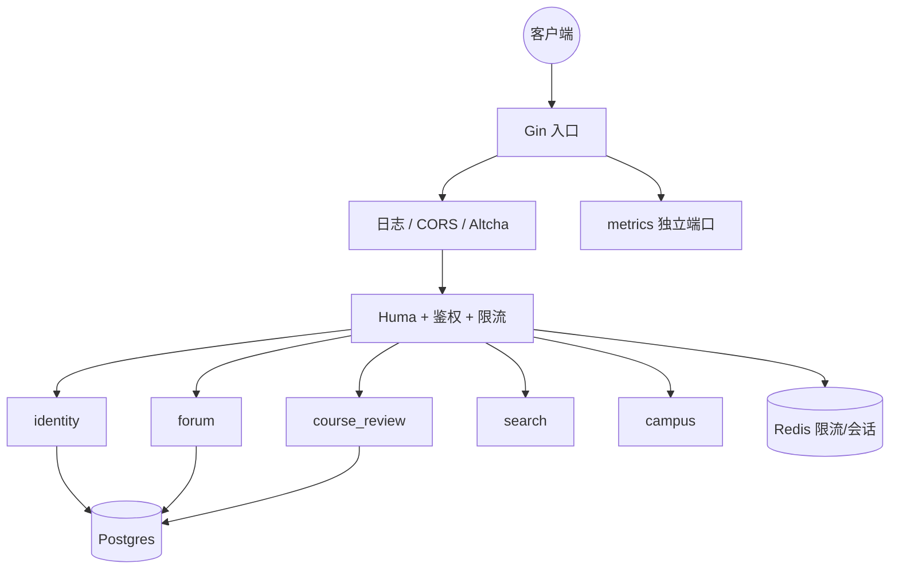

# 系统架构概览

**模块化单体**：业务在 `internal/domains/*`，底座在 `platform` + 中间件。

## 原则

1. **按域分包**：identity、forum、course_review、campus、search…  
2. **禁止跨域直接摸表**：只通过 Service / DTO  
3. **配置与观测统一**：`platform/config`、`platform/monitoring`  

## 组件关系

业务 API 经 **`httpapi.Register`** 声明 Access / Rate；见 [HTTP 注册规范](../api/httpapi.md)。

## 域职责（摘要）

| 域 | 职责 |
|----|------|
| identity | 登录注册、OIDC、会话、用户 API 凭证 |
| forum | 帖评与审核相关 |
| course_review | 课程、评价、给分 |
| campus | 课表、日历、空闲教室等（非代持武大密码） |
| dining | 食堂区域、楼宇楼层、档口、菜单、评价与投稿 |
| search | 统一搜索 |
| platform | DB、配置、缓存、metrics |

## 登录请求（示意）

1. `POST /api/v1/user/login`（`AccessPublic` + 验证码 / 限流等）  
2. 签发 access / refresh  
3. 后续：`Authorization: Bearer …`  
4. 中间件解析 JWT（可选会话绑定）  

**无**全站请求 HMAC。

## 请求链路

日志 → CORS → 限流 →（部分路径）人机校验 → Huma 认证 → Handler。

## 相关

- [安全策略](./security_policy.md)
- [模块索引](../modules/index.md)
- [环境搭建](../development/setup.md)
