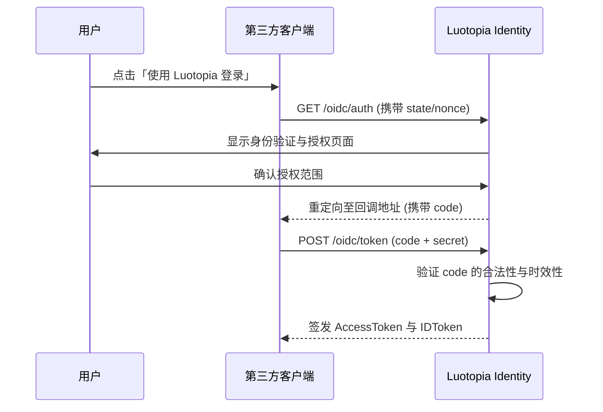

本模块实现了标准的 OpenID Connect 1.0 协议，支持第三方应用安全接入 Luotopia。

## 授权流程（`service/oidc_flow.go`）

系统主要支持 **Authorization Code Flow**：

1. **Authorize**：客户端引导用户至 `/oidc/auth`，带上 `client_id`、`response_type=code`、`scope`、`state` 及 `nonce`。
2. **Consent**：用户登录并确认授权范围。
3. **Token Exchange**：客户端通过 `/oidc/token` 使用 `code` 交换 `access_token` 和 `id_token`。

## 令牌管理（`service/tokens.go`）

### ID Token

- 包含用户核心身份声明（如 `sub`、`email`、`name` 等，以实际 claims 为准）。
- 签名材料由 identity OIDC **配置项**提供（密钥本身只放环境 / 密钥管理，**不进文档与 git**）。是否暴露 JWKS 以运行中 discovery 为准。
- **业务 API 的 Bearer access token** 与 OIDC ID Token 不是同一概念：业务 JWT 默认使用 `security.jwt_secret`（HS256）。

### Access Token

- 访问受保护 API；有效期见配置（如 `accessTokenTTL`）。
- 支持 refresh 轮换（客户端 / OIDC 流程分别对接对应端点）。

## 客户端管理（`service/oidc_apps.go`）

- **客户端类型**：支持 `confidential`（有密钥）和 `public`（无密钥，如移动端）。
- **重定向校验**：严格校验 `redirect_uri`，防止授权码劫持。

## 安全架构与流程分析

### 授权码流交互逻辑

**安全约束：**

- **CSRF 防护**：强制校验 `state` 参数，确保授权响应与原始请求的一致性。
- **重放攻击防御**：通过 `nonce` 参数验证 ID Token 的唯一性。
- **单次有效原则**：授权码（code）仅限单次使用，一旦换取令牌后即刻作废。

### 令牌加密存储机制

为了增强数据的静态安全性，系统在持久化层引入了透明加密机制：

- **算法选择**：采用 **AES-256-GCM** 对存储在数据库中的第三方 Access Token 进行对称加密，确保即使数据库备份泄露，令牌内容依然受保护。
- **密钥管理**：加密密钥由应用配置中心统一分发，支持在不停机的情况下进行密钥轮转。

## 常见问题

**Q：为什么 ID Token 的签名验证失败？**

A：请确保使用的是从 `.well-known/jwks.json` 端点获取的最新公钥。如果后端进行了密钥轮转，旧的公钥将失效。

**Q：授权码（code）的有效期是多久？**

A：授权码为短时效、单次有效凭证；有效期由 `identity.oidc` 配置决定，过期后需重新发起授权请求。

## 相关

- [身份认证模块](./index.md)
- [安全与防御策略](./security.md)
- [安全策略](../../architecture/security_policy.md)
